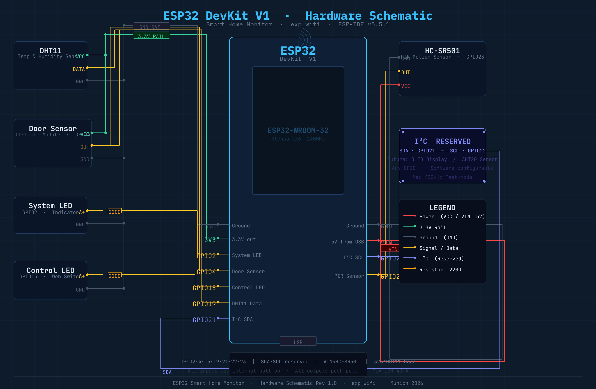

# ESP32 Smart Home Monitor

A Wi-Fi connected smart home system built on ESP32, featuring real-time sensor monitoring and automatic lighting control via a built-in web interface.

---

## Demo

> 📹 *Demo video coming soon*

---

## Features

- 🌡️ **Temperature & Humidity** — DHT11 sensor, displayed in real time
- 🚪 **Door Sensor** — Obstacle module detects open/closed state
- 🚶 **Motion Detection** — HC-SR501 PIR sensor
- ☀️ **Light Sensor** — Analog brightness level + digital threshold
- 💡 **Light Control** — Relay-driven LED, controllable via web switch
- 🤖 **Auto Light Logic** — Light turns on automatically when motion is detected; turns off 10 seconds after the last motion event. Manual web switch always takes priority.
- 📡 **Wi-Fi STA Mode** — Connects to home router, accessible from any device on the same network

---

## Hardware

### Components

| Component | Model | Interface |
|-----------|-------|-----------|
| Microcontroller | ESP32 DevKit V1 | — |
| Temp & Humidity | DHT11 | Single-wire |
| Door Sensor | Obstacle IR Module | Digital |
| Motion Sensor | HC-SR501 PIR | Digital |
| Light Sensor | LDR Module | ADC + Digital |
| Light Output | LED + 220Ω resistor | GPIO |
| System Indicator | LED + 220Ω resistor | GPIO |

### Pin Definitions

| GPIO | Function | Notes |
|------|----------|-------|
| GPIO2 | System LED | Boot indicator, always on when running |
| GPIO4 | Door Sensor (DO) | Pull-up input, LOW = door closed |
| GPIO13 | Light Sensor (DO) | Pull-up input, LOW = bright |
| GPIO15 | Control LED / Relay | Push-pull output |
| GPIO19 | DHT11 Data | Single-wire protocol |
| GPIO21 | I²C SDA | Reserved — future display / AHT20 |
| GPIO22 | I²C SCL | Reserved — future display / AHT20 |
| GPIO23 | HC-SR501 OUT | HIGH = motion detected |
| GPIO34 | Light Sensor (AO) | ADC1_CH6, analog brightness 0–4095 |

### Wiring



**Power:**
- HC-SR501 → **VIN (5V)**
- All other modules → **3.3V**

---

## Software Architecture

```
esp32_projects/exp_wifi/
├── main/
│   ├── main.c          — app_main, four framework tasks
│   └── web/index.html  — embedded web UI
├── wifi/               — Wi-Fi STA driver
├── http/               — HTTP server + REST API
├── sensor/             — DHT11, obstacle, IR, light sensor drivers
├── gpio/               — LED, relay output drivers
└── logic/              — Light auto-control state machine
```

### Task Architecture

| Task | Priority | Responsibility |
|------|----------|----------------|
| `io_task` | 4 | Reads all digital inputs every 100 ms |
| `sensor_task` | 4 | Reads DHT11 + light sensor every 2 s |
| `network_task` | 5 | Starts HTTP server, then self-deletes |
| `output_task` | 3 | Drives LED indicator |

All hardware modules are initialized in `app_main` before tasks start, eliminating race conditions.

### Module Interaction & Data Flow

```
app_main
  │
  ├─ Hardware Init (all GPIO / ADC before tasks start)
  │
  ├─► io_task (100ms)
  │     ├─ obstacle_detected()       ──► http_server_update_obstacle()
  │     ├─ ir_sensor_detected()      ──► http_server_update_ir()
  │     │                            ──► light_ctrl_on_motion() / light_ctrl_on_idle()
  │     └─ light_ctrl_tick()         ──► relay_set() (auto off timer)
  │
  ├─► sensor_task (2000ms)
  │     ├─ dht11_read()              ──► http_server_update_sensor()
  │     └─ light_sensor_analog/digital() ──► http_server_update_light()
  │
  ├─► network_task
  │     └─ http_server_start()
  │           └─ httpd_thread (internal, event-driven)
  │                 ├─ GET /              → serve index.html (embedded in flash)
  │                 ├─ GET /api/sensors  → read caches → JSON response
  │                 └─ POST /api/relay   → light_ctrl_set_manual() → relay_set()
  │
  └─► output_task (1000ms)
        └─ led_on() (system running indicator)
```

**Key design decisions:**
- Sensor data is written to caches by tasks, read from caches by HTTP handlers — no blocking in request handling
- `light_ctrl` is the single source of truth for relay state; both `io_task` (auto) and HTTP handler (manual) go through it
- `index.html` is embedded in firmware via `EMBED_FILES`, no filesystem needed
- Browser polls `/api/sensors` every 2 seconds via `setInterval` — simple and reliable over LAN

### REST API

| Method | Endpoint | Description |
|--------|----------|-------------|
| GET | `/` | Web UI (index.html) |
| GET | `/api/sensors` | All sensor data as JSON |
| POST | `/api/relay` | Control light relay |

**GET /api/sensors response:**
```json
{
  "temperature": 24.5,
  "humidity": 61.0,
  "door": 1,
  "motion": 0,
  "light": 0,
  "lux": 78,
  "lux_raw": 872,
  "bright": 1
}
```

**POST /api/relay body:**
```json
{ "id": 1, "state": 1 }
```

---

## Auto Light Logic

```
Motion detected
    └─► Light ON, start 10s timer
            ├─ Motion again    → reset timer
            ├─ Timer expires   → Light OFF
            ├─ Manual ON (web) → stays on, timer cancelled
            └─ Manual OFF      → immediate off, suppressed until PIR clears
```

---

## Build & Flash

### Prerequisites

- [ESP-IDF v5.5.1](https://docs.espressif.com/projects/esp-idf/en/latest/)
- ESP32 DevKit V1

### Setup

```bash
source /path/to/esp-idf/export.sh
```

### Configure Wi-Fi

```bash
idf.py menuconfig
# Example Configuration → Wi-Fi SSID / Password
```

### Build & Flash

```bash
idf.py build
idf.py -p /dev/cu.usbserial-XXXX flash monitor
```

### Access Web UI

After connecting to Wi-Fi, the ESP32 IP address is printed in the serial monitor:

```
I (xxxx) wifi station: got ip:192.168.x.x
```

Open that address in any browser on the same network.

---

## Roadmap

- [ ] Replace DHT11 with AHT20 (I²C, more reliable)
- [ ] Add OLED display (I²C, GPIO21/22 reserved)
- [ ] Online weather via OpenWeatherMap API
- [ ] MQTT support for remote access
- [ ] Coupled control logic (auto light only when dark, away mode, temperature-based relay)

---

## License

MIT
